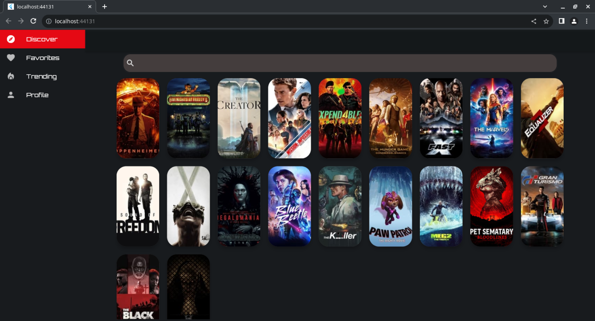
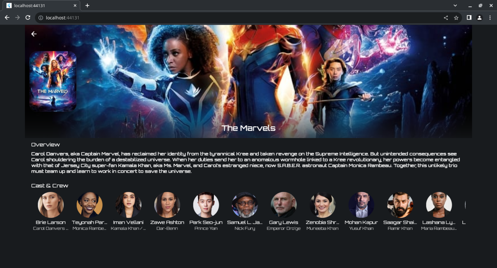
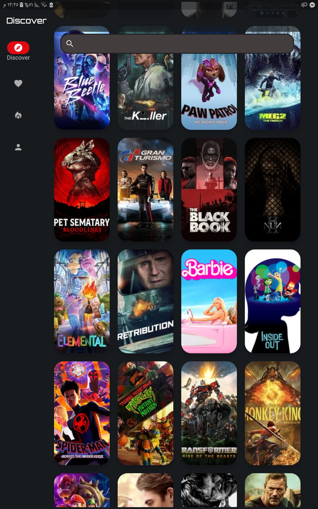
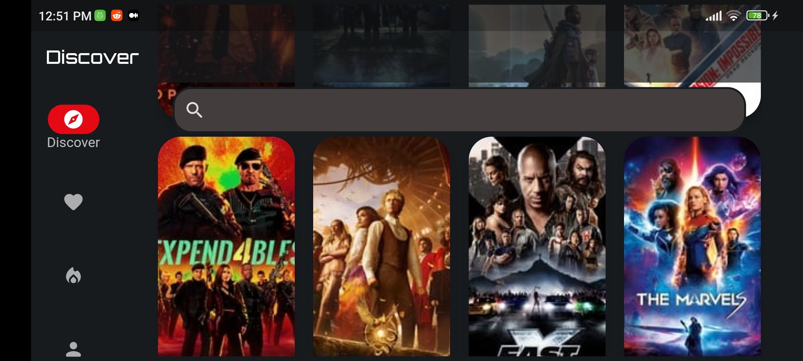
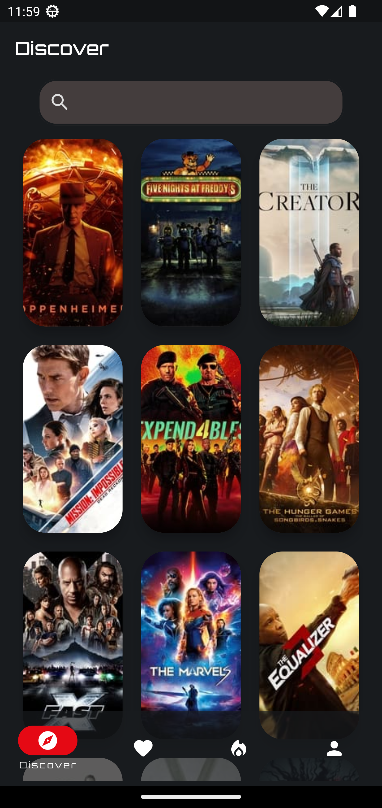
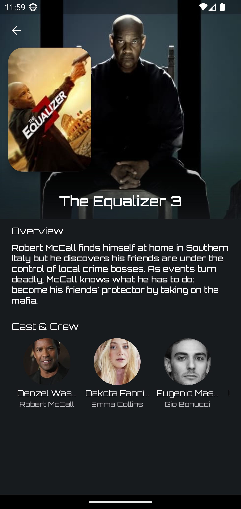
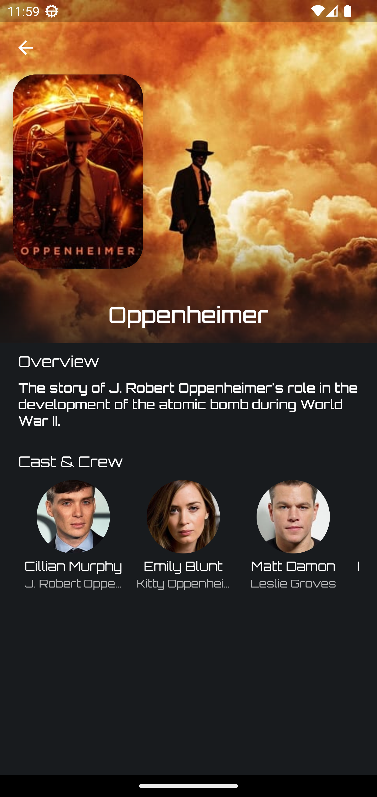

# Movie application _(Magdy Yacoub)_
# Table of content
1. [Preview](#preview)
2. [Key Features](#features)
3. [Packages Used](#packages)
4. [Installation](#installation)


<a name="preview"></a>
## Preview 
| **Wide Screen**|
|  :---: |
|  |
|  |
| **Tablet Size** |
| |
| **Phone Size** |
|   |

<a name="features"></a>
## Key Features

* **Secured API key**
* **infinite scrolling**
* **responsive layout**

<a name="packages"></a>
## Main Packages Used

* **Flutter Bloc**
* **Freezed**
* **Cached Network Image**
* **Envied**

<a name="installation"></a>
## Installation
Update the `secret_keys.env` file in the root directory with your API key
```
TMDB_KEY='paste_your_API_key_here'
```

Then, run build runner for code generation in your terminal using this command:

```
dart run build_runner build --delete-conflicting-outputs
```
Then run the app on your desieried platform.
